# 'What We do in The Shadows' Quiz

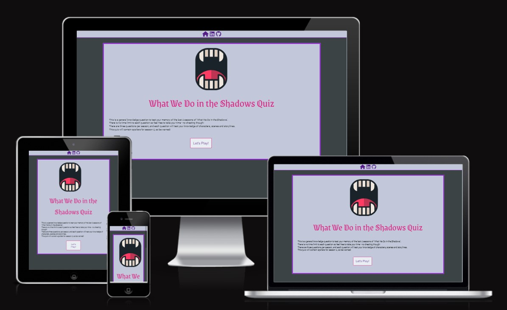

[Live link](https://alcl2000.github.io/PP2-Amy-lewis/) 
'What We do in The Shadows is an New Zealand/American Horror comedy film and TV show. It recently aired its 4th season in the United States and has gathered a large online following
This Quiz was designed for fans to test their knowledge of the show and to have fun sharing their scores.

---

## Contents

- [User Experience](#user-experience)
    -[User Stories](#user-stories)
- [Design Choices](#design-choices) 
    -[Colour Selection](#colour-selection) 
    -[Typography](#typography) 
- [Wireframes](#wireframes)
- [Features](#features) 
    -[Index](#index-page-1) 
    -[Quiz](#quiz-page-1) 
    -[Results](#results-page-1) 
    -[Features to be added](#features-to-be-added) 
- [Bugs](#bugs)
- [Testing](#testing) 
    -[Manual](#manual) 
    -[Validators](#validators) 
- [Credits](#credits)

---
## User Experience

### Initial discussion

The fourth season of 'What We Do in the Shadows'  finished airing in the United States and Canada in September, and will soon be aired around the world. The show's fanbase continues to grow, and the show has been renewed for a fifth and sixth season. 

To celebrate, this quiz was created to increase fan engagement between seasons and international airing.

### Key Information on the Site

- How the quiz works
- Which seasons the questions are about
- How many questions there are

## User Stories

### Client Goals

- I want users to be able to take a quiz based on a popular show
- I want users to get a fun result based on their score and be able to share this score with others

### Intital user Goals

- I want to know how the quiz works
- I want to know what content will be in the quiz
- To have a wide range of questions to answer

## Returning user goals

- I want to be able to compare my score to my previous score

---
## Design Choices

### Colour selection

The colours for this website were picked from various promotional materials for the show
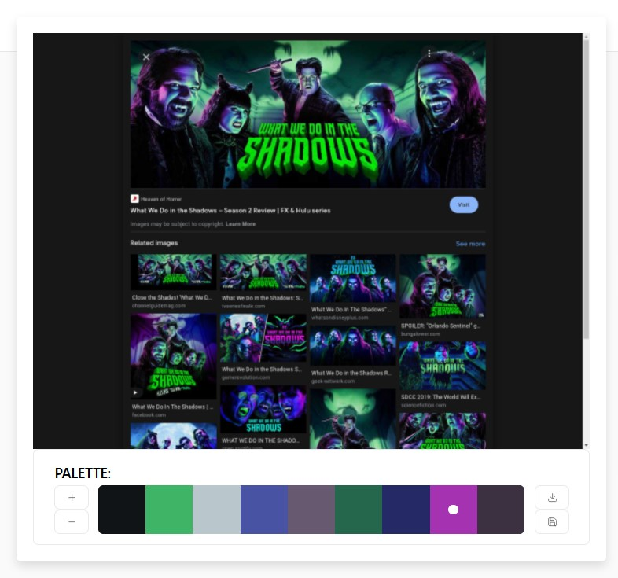
- I then picked out similar and complimentary colours to match the ones picked from these posters
- I decided on using lighter colours for accessibilty and contrast
- And brighter tones to make the website seem more appealing
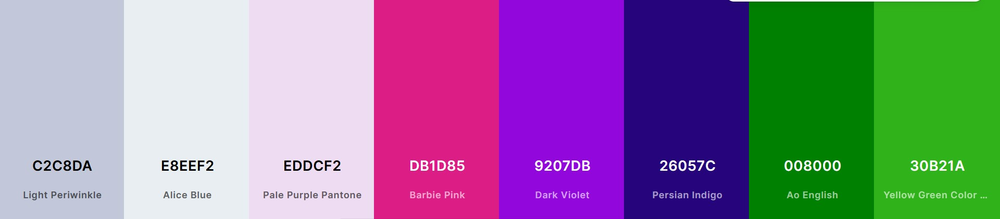
- Not all of these colours were used in the final project, but having them available while developing allowed me to consider mulitple options for each element
- Eventually I decided to stick with reds and purples to create a sense of cohesion and to fit the vampire theme

### Typography

I used three different fonts throughout the site.

The main title font used was picked for its resemblance to the font used in the title of 'What We Do in the Shadows'

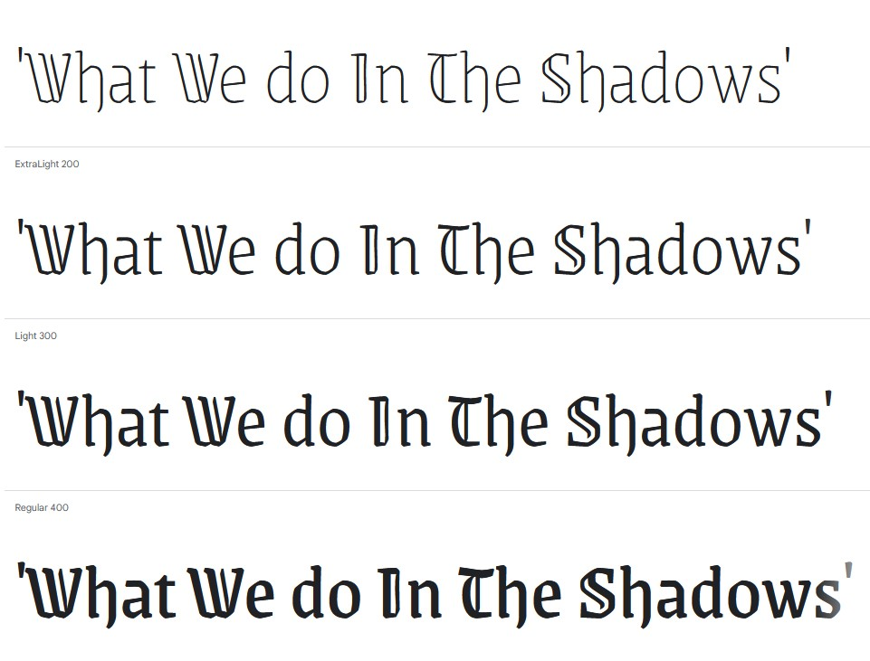

The secondary font was used to differentiate from the main body font, while being more legible than the title font, allowing for easier reading in the questions

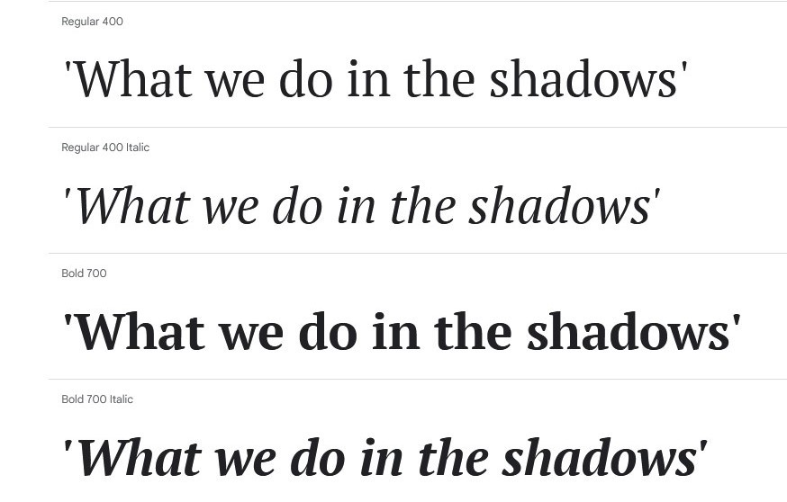

The final font was picked for its clean appearance and legibility

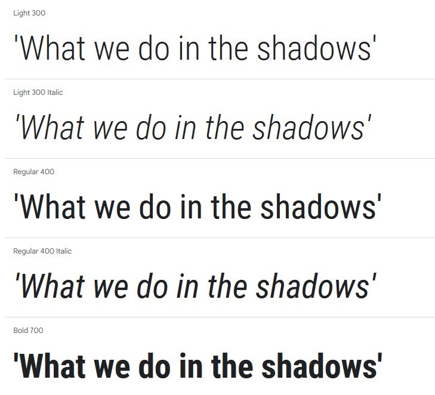

### Logo Selection 

The logo for this website was picked from [PNG Repo](https://www.pngrepo.com/svg/200392/fangs-vampire). It is a simple logo that clearly displays what the show is about. The logo was then re-used for the favicon to provide clear identification amongst browser tabs.

## Wireframes

### Site Map

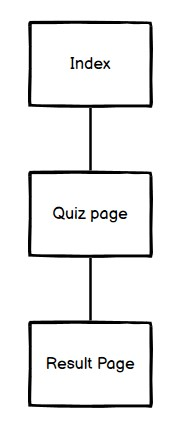

### Index Page

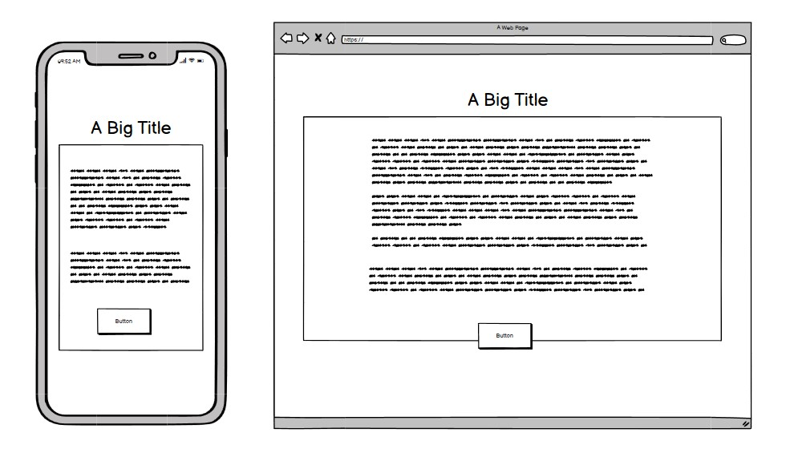

### Quiz Page

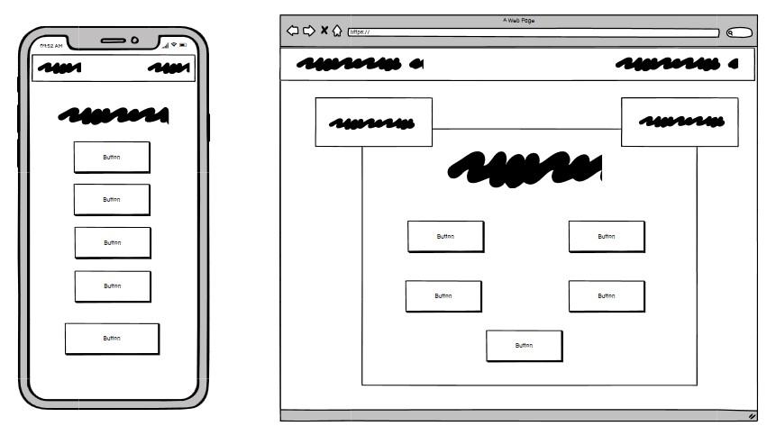

### Results page

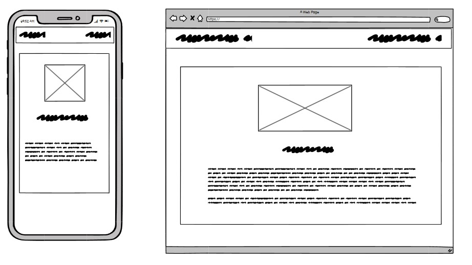

---
## Features

### Header

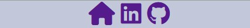

The header is present on every page. It has the home home button along with a link to my Git hub and linked in available on each page.

## Index Page

The index page features the title of the quiz, along with a short description of the rules. There is also a button to access the quiz. 

### Title

The title clearly shows the user what site they're on and sets the tone for the website

### Logo

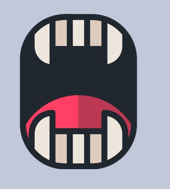

The logo is a cartoon set of vampire teeth, the logo is simple and shows the user clearly what the site is about

### Rules

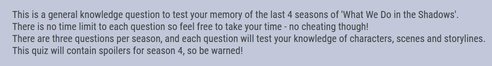

Below the logo are a short set of rules which allow the user to quickly understand what the quiz is about and how to use it.

### Enter Button

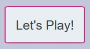

The enter button lets the user start the quiz.

## Quiz page

The quiz page Features the main quiz loop for the players. It displays the quiz title and number. 
It also shows a quiz score for the player. 

### Question

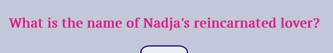
When a question is answered the quiz page will either confirm the user got the question correct or show them the correct answer if they got the answer wrong.

### Question Number

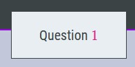

This box allows the user to clearly see which question they are on, as well as know how many questions are left

### Score Box

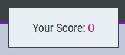

This box allows users to clearly see how many points they have scored so far, it iterates every time they answer correctly

### Buttons

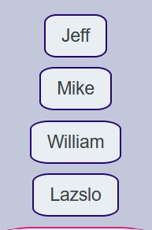

The buttons display the correct answer sets for each question 
-Incorrect initial user input does not allow for re-selection when correct answer is displayed, as the event listeners are removed

### Next Question Button

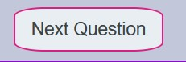

This button allows users to skip the question if they are unsure of the answer, or after they get an answer incorrect, as the event listeners are removed in this case

## Results Page

The results page displays the user's final score at the end of the quiz, along with a short paragraph describing their results. In a comical way to encourage them to re-watch the show and re-take the quiz.

### Results Title

The results title is a fun way for users to compare results with others

### Results Text

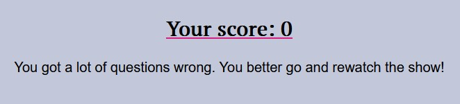

The results text displays a fun tag to encourage the user to play the quiz again and compare their results to others

### Return buttons

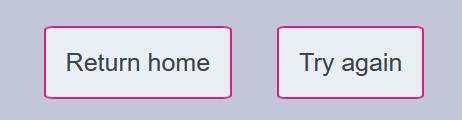

Two buttons that allow users to navigate without using browser buttons

### Correct and Incorrect alert

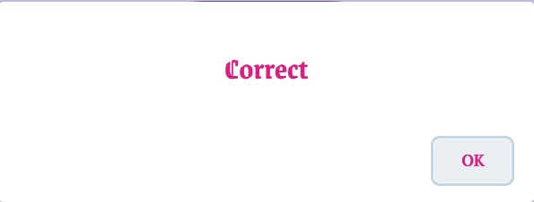 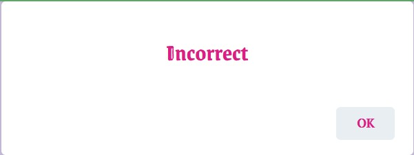

The alerts are a direct way of letting the user know if they have gotten the answer incorrect or correct, to reduce any possible confusion

### Correction Box

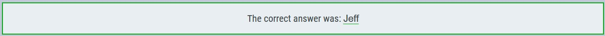

This box corrects users when they get answer wrong, it displays the correct answer according to the question id

### Favicon

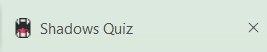

The Favicon is the website's logo and helps to make the website standout amongst other tabs 

## Features to be added

### Score board 

Adding a leader board would allow users to compare their score, to take the quiz again with the aim of getting a higher score and getting their name on the leader board

### Share Button

Adding a share button, so that users can share their score across social media, would allow for more engagment outside of the intial users, so that more users can become aware of - and take the quiz.

### Alternate questions

Adding an alternate array of questions would increase the chances of return users, and increase the challenge by providing questions that former users do not expect

---

## Bugs 

### The Game did not always redirect users after a correct answer input

The first question specifically did not automatically redirect for the user upon entering a correct answer. To solve this I added an if statement to the next question function, which checks if the id = 0. If it does, the next question is called but the id is iterated before that. Otherwise the next question is called as normal.

### 'Questions[id] is undefined'

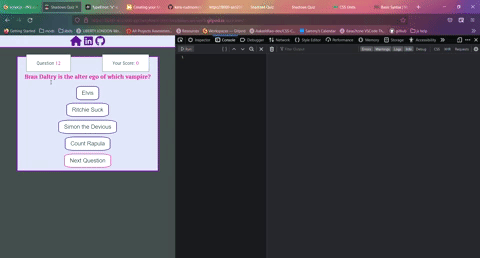

Here the error was caused by the id variable, the if statement used to decide iteration used the array length as the upper limit. The code was not automatically ending the iteration loop when the id was equal to the length of the array, and emitting an error when the user either answered or skipped the last question

This was solved by switching from using the array length to the hard coded number 11

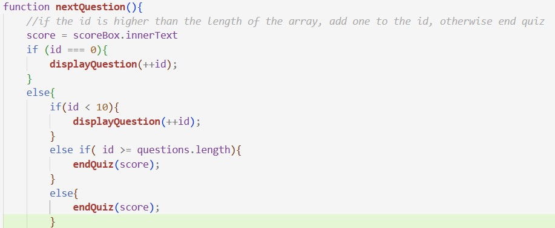

### Score error

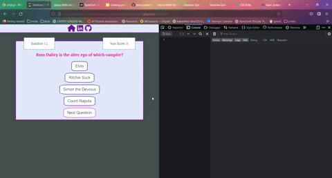

Here the error was being produced by the script page not connected to the results page. The script was attempting to locate an element specific to the results page, that was being targetted by results.js instead. 

This was solved by removing obsolete code from before the implementation of the local data method

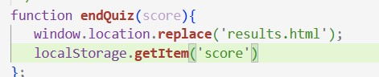

---
## Testing

### Manual

#### Testing User Stories

|User Story|Aim Achieved?|
|---|---|
|First Time Users ||
|I want to know how the quiz works|The index page explains the rules and that there is no timer|
|I want to know what content will be in the quiz| The index page states that all four seasons will be included|
|I want to have a wide range of questions to answer| The quiz has 12 questions to answer, three for each season, due to time constraints I was not able to add different arrays of varying difficulty|
|Returning User Goals||
|I want to be able to compare my score to my previous score| The results page clearly shows the User's results and a short tagline explaining how they did|

#### Full Testing

Additional testing and feedback was supplied by my friends on a variety of devices

|Feature | Expected Outcome | Testing Outcome | Result
|---|---|---|---|
|Nav Bar|||
|Home Button| On click, should return the user to the index page| On click, the button returns users | Pass
|GitHub Link | On Click, should open a new tab for the user to be taken to my GitHub profile | On click, it opens a new tab to my GitHub| Pass|
|LinkedIn Link| On Click, should open a new tab for the user to be taken to my LinkedIn profile | On click, it opens a new tab to my LinkedIn Profile | Pass|
|Index|||
|'Let's Play' Button| On Click, should take users to the quiz page| On click, takes users to the Quiz page| Pass|
|Quiz Page|||
|Score Counter | On a correct answer input, the score should iterate by 1| Correct answers were supplied, both individually and all at once, successfully iterating each time| Pass|
|Question counter| On each iteration, the question number should increase by 1| When the question is answered correctly or 'Next Question' is pressed the question counter increases by 1| Pass|
| Question| The Question should Iterate with the question counter, following the array | On pressing 'Next Question' or answering correctly the question should change| When the question number iterates, the question changes| Pass|
|Corrected Answer| When the question is answered incorrectly, the correct answer should drop below the question| When answered incorrectly, the box reveals the correct answer according to the array| Pass|
|Incorrect Alert| When the question is answered incorrectly an alert pops up to inform the user they answered incorrectly| When an incorrect answer is supplied, the alert appears| Pass|
|Correct Alert|When the question is answered incorrectly an alert pops up to inform the user they answered correctly|When an correct answer is supplied, the alert appears| Pass|
|Answer Buttons |The buttons should display the answers from the array and change with the question, when the user answer is incorrect they event listener should be removed|When the question iterates, the value of the buttons changes. When an incorrect answer is supplied the buttons no longer work |Pass|
|Next Question Button| The button should iterate the question, whether or not an answer has been supplied| On click, The button iterates, even if a question has not been answered| Pass|
|Results page|||
|Results Title| The title should change dependant on the score the user achieves, allowing users to compare scores| On supplying different scores through local.data() and manual quiz use the text changes |Pass|
|Final Score| The inner text should display the user score as a number to show the result| On supplying different scores through manual testing and local.data() the inner value of the score changes| Pass|
|Results Text |The title should change dependant on the score the user achieves, allowing users to compare scores|On supplying different scores through local.data() and manual quiz use the text changes|Pass|
|'Return Home' button| On click, the button should return the user home| When pressed, the button returns the user home| Pass|
|'Try Again' button'| On click, the button should take the user to the quiz page| When pressed, the quiz starts from the first question|Pass|

Testing was performed during development and 
The site was built using HTML, CSS and JavaScript only and as such, can work on all browsers, during development and testing the following browsers were used without error:
- Chrome
- Chrome mobile
- FireFox
- Microsoft Edge
- Safari mobile

Due to the nature of the code used, all devices are supported.

The following breakpoints were implemented to allow for cross-device performance

|Screen Type | BreakPoint |
|---|---|
|Mobile | Deafault Protocol|
|Horizontal Mobile | 400px|
|Tablet | 900px|
|Large Screens and above | 1400px|

### Validators

#### All three HTML pages were passed through the official W3C code validator

- [Index](https://validator.w3.org/nu/?doc=https%3A%2F%2Falcl2000.github.io%2FPP2-Amy-lewis%2Findex.html)
- [Quiz](https://validator.w3.org/nu/?doc=https%3A%2F%2Falcl2000.github.io%2FPP2-Amy-lewis%2Fquiz.html%3F)
- [Results](https://validator.w3.org/nu/?doc=https%3A%2F%2Falcl2000.github.io%2FPP2-Amy-lewis%2Fresults.html)

#### The CSS Page was validated the same way

- 

#### JavaScript Validators

- 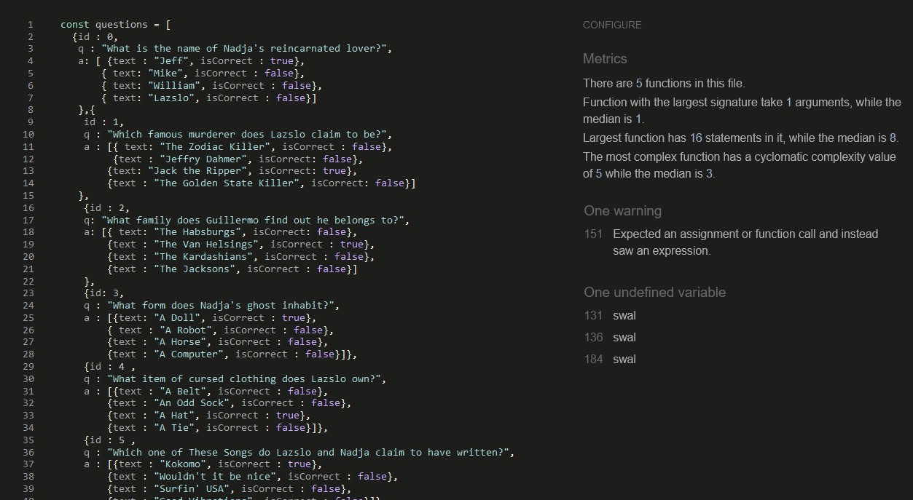
The undefined variable is swal - the sweet alerts library in use on my page, the expresson on line 151 is a nested if statement.

- 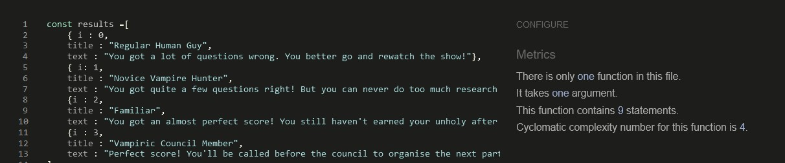

### LightHouse Validation

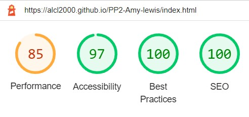
- The lowered performance score is due to the image and fonts load response

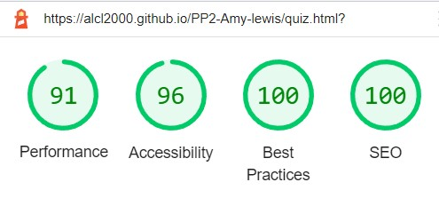

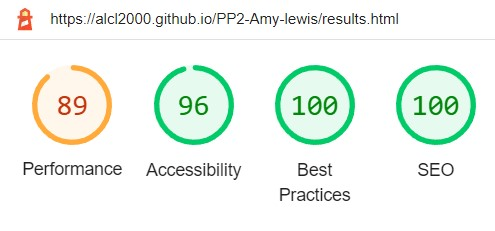

---
## Deployment and Local Development

### Deployment

This project was deployed using GitHub pages through this link: [Live page](https://alcl2000.github.io/PP2-Amy-lewis/). 

Deploying through GitHub pages
- Log in/Sign up to GitHub
- Open the repository 
- Locate the settings
- Click under 'Pages'
- Under "Source", choose which branch to deploy (usally 'Main')
- Choose which folder to deploy from, usually "/root"
- Click "Save", then wait for it to be deployed
- Your URL will be displayed above "Source"

### Local Development

The repository is available on GitHub and is available for users to clone and fork [Link to repository here](https://github.com/alcl2000/PP2-Amy-lewis)

### How to Fork

- Log in/ Sign up to GitHub 
- Go to the repository for this project [https://github.com/alcl2000/PP2-Amy-lewis](Link Here)
- Click fork on the right corner

### How to Clone

- Log in/ Sign up to GitHub 
- Go to the repository for this project [https://github.com/alcl2000/PP2-Amy-lewis](Link Here)
- Click on the dropdown 'Code' button, and select your prefered format
- Copy the provided link 
- Use the command 'git clone'and paste your link into your IDE's CLI

---
## Credits 

### Languages used
This project is built using HTML, CSS and JavaScript only

### Frameworks, Programs and Libraries

- Balsamiq - Wireframes 
- Git - Version Control
- Git Hub - Repository hosting
- Git Hub - Pages web page hosting 
- Sweet Alert - Custom JS alerts
- Favicon.io - Page favicon
- Google Fonts - Fonts used throughout
- Font Awesome - Social media icons
- Am I responsive - Mockup 
- [Coolors.co](https://coolors.co/) - To generate and edit the colour palette used on the site

### Assets

- Logo from [PNG Repo](https://www.pngrepo.com/svg/200392/fangs-vampire)
- JS Alert Framework from [Sweet Alert](https://sweetalert.js.org/)

### Other content

All text on this site was written by myself, with the rights of 'What We Do in the Shadows' belonging to the FX network and the other copyright holders

#### Google Fonts used

- [PT Serif](https://fonts.google.com/?query=ParaType&category=Serif,Monospace&preview.text=Question%201:&preview.text_type=custom)
- [Roboto Condensed](https://fonts.google.com/specimen/Roboto+Condensed?query=roboto&category=Serif,Sans+Serif,Display,Monospace&preview.text=Question%201:&preview.text_type=custom)
- [Grenze Gotisch](https://fonts.google.com/specimen/Grenze+Gotisch)

#### Tutorials

[JS quiz tutorial](https://www.geeksforgeeks.org/how-to-create-a-simple-javascript-quiz/)

### With thanks

Thanks to my mentor, Sammy, Ed from tutor support and the 'What We Do In The Shadows' discord for help with ideas, testing, and JavaScript wrangling